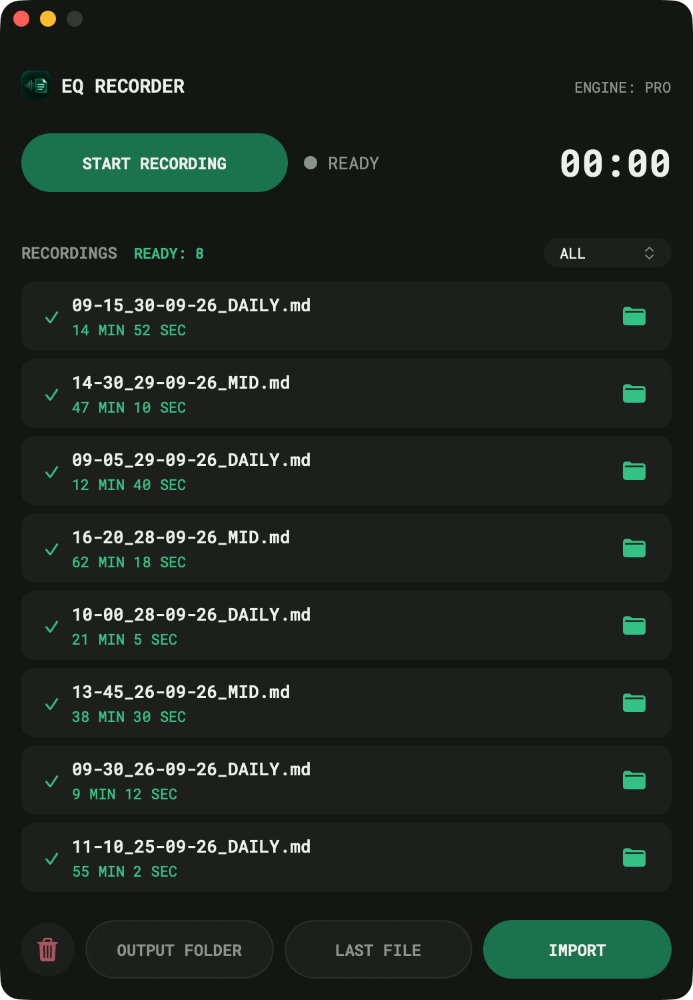

# EQ Recorder

A small macOS app that records a meeting (or takes any audio/video file) and
turns it into a Markdown transcript with timestamps. Everything runs on your
Mac: no account, no API key, no upload.

It is built for meetings in Ukrainian mixed with Russian and English, which
stock Whisper handles badly. Most of the work is in getting the language
right (see [Quality](#quality)); the app around it is kept deliberately small.

<p align="center"></p>

## What it does

- Records the microphone with one button, or imports any audio/video file
  (mp3, wav, m4a, aac, ogg, mp4, mov, avi, mkv).
- Transcribes in the background, one file at a time. You can start the
  next recording while the previous one is still being processed.
- Writes `output/<time>_<date>_<DAILY|MID>.md` with timestamps and
  per-segment language tags.
- Handles long files (2–3+ hours) by splitting them into chunks; an
  interrupted transcription resumes from a checkpoint.

What each state in the window means is explained in plain language in
[docs/UI_STATES.md](docs/UI_STATES.md).

## Requirements

EQ Recorder runs on macOS with Apple Silicon only (MLX Whisper requires
Metal GPU acceleration). There is no Windows support.

- macOS 12+ on Apple Silicon (the default engine is MLX, which uses the GPU)
- **Python 3.10 from Homebrew** (`brew install python@3.10`), exactly this
  version: the pinned `requirements.txt` and the app launcher are built
  against it. It is used only to create the project's own `.venv`.
- ffmpeg (`brew install ffmpeg`)
- Xcode Command Line Tools (`xcode-select --install`) — `build_app.sh`
  compiles a tiny native launcher for the app bundle

## Installation

```bash
git clone <this repo> eq-recorder && cd eq-recorder
brew install ffmpeg python@3.10
/opt/homebrew/bin/python3.10 -m venv .venv
.venv/bin/pip install -r requirements.txt
./build_app.sh                    # → /Applications/EQ Recorder.app
open "/Applications/EQ Recorder.app"
```

The first launch downloads the Whisper model (`large-v3-turbo`, ~1.6 GB, see
`models/README.md`).

**Why a project-local `.venv`:** nothing except `pip install -r requirements.txt`
can change what the app imports; a shared Homebrew environment can be
changed by any other tool on the machine (for example an upgraded `scipy`).
`start.sh` and the app bundle both use `.venv/bin/python3.10`, never a bare
`python3`.

**macOS permissions on first launch** — each is asked once:

- *Microphone* — required for recording.
- *Files in Desktop/Documents folder* — only if the project folder lives
  there (the app reads its code and `.venv` from the project folder).
- *Accessibility* — optional, only for the global hotkeys. While it's not
  granted, a gear icon in the header opens the right settings page.

The bundle is ad-hoc signed with a requirement tied to its bundle id
(`com.eq.recorder`), so these permissions survive rebuilding the app.

## Usage

Start the app from the bundle (or `./start.sh` from a terminal). Clicking
the Dock icon shows the window; clicking it again while the window is in
front hides it. Hiding or closing the window does not stop a recording or
the transcription queue. Launching the app a second time just brings the
running one forward.

- **START RECORDING** — the button turns red, `● REC` blinks and the timer
  counts up. **STOP RECORDING** saves the WAV to `recordings/` and queues it.
- **IMPORT** — pick any audio/video file; it's converted and queued.
- **Recordings list** — one card per file. Clicking a card only selects it.
  The icon on the right does the action: 🎤 transcribe (or retry) a file
  with no transcript, 📁 show a finished transcript in Finder.
- **ALL ⌃** — show all transcripts, only today's recordings (by the date in
  the file name), or sort by length.
- **🗑** — delete the selected card's file (asks first), or remove a queued
  file from the queue.
- **OUTPUT FOLDER** opens `output/`. **LAST FILE** opens Finder with the
  newest transcript already selected.
- `READY: N` — transcripts in `output/`. `PROCESSING: N` — files still
  waiting for Whisper, including the one in progress (hidden when 0).

## Hotkeys

| Action | Mac | Notes |
|---|---|---|
| Toggle recording | `Cmd+E` | one key: first press starts, the same press again stops |
| Show/hide panel | `Cmd+Shift+H` | |

`Cmd+E` may also toggle the camera in Google Meet.

They work from any app, not only when EQ Recorder is in front. They need the
**Accessibility** permission (details: [Global hotkeys](docs/ARCHITECTURE.md#global-hotkeys)):

1. Click the gear icon in the app header (or open
   [System Settings → Privacy & Security → Accessibility](x-apple.systempreferences:com.apple.preference.security?Privacy_Accessibility)).
2. Turn on **EQ Recorder** (add it with `+` from `/Applications` if missing;
   if it's listed but doesn't work, remove it with `−` and add it again).
3. Quit and reopen the app — the permission is only picked up at launch.
   The gear disappears once it's granted.

## Output

Markdown goes to `output/`; if the `EQ_VAULT_DIR` environment variable points
to an existing folder (e.g. an Obsidian vault), a copy goes there too. WAV originals stay in `recordings/`.

```
output/HH-MM_DD-MM-YY_DAILY.md     recording started before 12:00, e.g. 09-15_01-03-26_DAILY.md
output/HH-MM_DD-MM-YY_MID.md       recording started at 12:00 or later, e.g. 14-30_01-03-26_MID.md
```

Time first, then a short date, so files scan by time of day. The name comes
from the recording time only; the transcript is never read for it. Two
recordings in the same minute get `_2`, `_3`.

## Quality

- Audio is cleaned once with ffmpeg:
  `highpass=100, lowpass=8000, afftdn, dynaudnorm`
- Whisper `large-v3-turbo`, run through MLX on the Apple Silicon GPU — for
  both decoding and language detection (one model in memory). About 20×
  realtime on an M4 Pro. `EQ_ENGINE=whisper` switches to the CPU
  `openai-whisper` package as a fallback
- Greedy decoding at temperature `0.0` on the first pass (MLX has no beam
  search; the CPU fallback uses beam 5). Higher temperatures with
  `best_of 5` are used only when a segment fails the quality thresholds —
  without that fallback Whisper can loop on repeated text
- **Language is detected per 30-second window, not once per file** — see below
- **No `initial_prompt`, `condition_on_previous_text=False`** — see below
- `word_timestamps` is off: the per-word data is not used (`build_md` only
  reads `seg["start"]`) and it costs ~19% of the runtime
- Files longer than 30 min are split into 10-minute chunks so memory stays
  flat; progress inside Whisper is reported either way

Override via environment variables:

```bash
EQ_WHISPER_MODEL=small  ./start.sh   # lighter, faster, more repetition loops
EQ_WHISPER_LANG=uk      ./start.sh   # force one language, skip detection
EQ_WHISPER_LANG=auto    ./start.sh   # back to per-window detection (default)
EQ_WHISPER_PROMPT="..." ./start.sh   # re-enable an initial prompt
EQ_PER_CHUNK_LANG=0     ./start.sh   # plain whisper behaviour (one detect/file)
EQ_LANG_UK_BIAS=1.0     ./start.sh   # drop the uk prior (default 2.0)
EQ_LANG_UK_MARGIN=0.15  ./start.sh   # uk wins ru/uk ties this close (default)
EQ_FORCE_UKRAINIAN=1    ./start.sh   # transcribe EVERY segment as uk — not
                                     # translation (whisper can't translate
                                     # into uk), only for meetings that are
                                     # actually Ukrainian but keep getting
                                     # misdetected as ru
```

### Why the language is detected per window

Stock Whisper detects the language **once, on the first 30 seconds**, and
applies it to the whole file; there is no per-segment switching. In a meeting
that mixes uk, ru and en, one wrong opening decides everything: a file that
starts in `ru` is transcribed entirely as `ru`, and Ukrainian is bent into ru
phonetics (`Добрий день` → `Добрый день`, `Дякую, все зрозуміло` →
`Спасибо, все понятно`).

> Без мови рідної, юначе, й народу нашого нема.
> Вона — як серце, що гаряче, без неї в світі ми — пітьма.

So the language is decided by the app's own pass (`transcriber.py`):

1. `detect_language_windows()` runs one encoder pass per 30 s window (30 s is
   exactly what the encoder sees at once, so it is the finest granularity on
   which detection is defined). Probabilities are renormalised over
   `uk/ru/en`. Polish is deliberately not a candidate: it is not needed, and
   the detector tends to take Ukrainian for Polish. Near-silent windows are
   dropped, because Whisper answers `en` with p ≈ 0.99 on silence, and one
   such window in the tail would otherwise assign English to a whole file.
2. `group_language_runs()` smooths windows over ±1 neighbour and merges them
   into language runs; runs shorter than 60 s are absorbed into their
   neighbour, so one English phrase does not cut the file in two.
3. Each run is decoded separately with its own language. `build_md()` tags a
   segment with `` `[ru]` `` only where the language changes.

The detection pass costs about 4 % of the total runtime.

**The `uk` prior (`EQ_LANG_UK_BIAS`, default 2.0).** Whisper's detector is
biased towards `ru`: on a clearly Ukrainian opening line it can answer `ru`
0.89 vs `uk` 0.05. Comparing `avg_logprob` of the two decodes does **not**
fix this, because `ru` wins the logprob even where its own output is visibly
mangled (`добрый день, чуєте менія`): it is far better represented in the
training data. A prior is the only lever that works: `ru` must be at least 2×
more likely than `uk` for a window to go `ru`. Confident `ru` is untouched;
near-ties go to Ukrainian, which is where Ukrainian words would otherwise be
mangled. Illustrative output for a disputed stretch:

| Forced language | Output |
|---|---|
| `ru` | `добрый день, дякую, все понятно, до зустрічі` |
| `uk` | `добрий день, дякую, все зрозуміло, до зустрічі` |

`EQ_LANG_UK_BIAS=3.0` starts flipping genuinely ambiguous `ru` files, `1.0`
disables the prior. With the `large-v3-turbo` detector most speech windows
are decided without any prior, so it only affects a small share of windows.

**No `initial_prompt`.** A prompt that lists speaker names
(`Імена: Спікер A, Спікер B, …`) is echoed verbatim into the transcript
(`Спікер A, Спікер B, Спікер B, Спікер A…`) and drives Whisper into a
repetition loop. Every loop triggers temperature fallbacks (6 passes, beam 5
on the CPU engine), which can make a few minutes of audio take many times
longer than realtime. With no prompt and `condition_on_previous_text=False`
there is nothing to echo and no context for a loop to feed on, so the speed
stays stable and the hallucinated filler is gone.

The remaining quality ceiling is the **audio itself**: a far-away laptop mic
plus heavy surzhyk. `large-v3-turbo` does not loop on quiet stretches and
keeps technical terms (`дедлайн`, `API`, `репозиторій`) well.

## Project layout

```
eq-recorder/
├── app/
│   ├── recorder.py          entry point + recording engine
│   ├── transcriber.py       Whisper, per-window language detection, Markdown
│   ├── transcribe_queue.py  FIFO queue, one worker thread
│   ├── audio_import.py      file picker + ffmpeg conversion
│   ├── ui.py                the window (AppKit + AutoLayout)
│   ├── theme.py             design tokens: colors, type, spacing, layout
│   ├── strings.py           every user-facing string
│   └── config.py            paths, constants, single-instance check
├── launcher/launcher.m      native launcher compiled into the app bundle
├── build_app.sh             builds "EQ Recorder.app"
├── start.sh                 run from a terminal
├── assets/                  your icon source (see "Replacing the app icon")
├── scripts/                 update_icon.sh, _squircle_mask.py
├── resources/               generated icon files + bundled Roboto Mono
├── models/                  no weights here, see models/README.md
├── docs/
│   ├── ARCHITECTURE.md      how the pieces fit together
│   ├── DESIGN_SYSTEM.md     tokens and every component state
│   ├── UI_STATES.md         what each state means, for non-developers
│   └── images/
├── recordings/  output/  .venv/  .state/     (gitignored)
└── requirements.txt
```

### Rebuilding the app bundle

```bash
./build_app.sh                 # → /Applications/EQ Recorder.app
./build_app.sh <folder>        # build somewhere else
```

The bundle doesn't contain the code: it runs `app/*.py` from this folder,
so Python edits take effect on the next launch without a rebuild. Rebuild
after changing `launcher/launcher.m`, the icon or `Info.plist`.

Keep **one** copy of the bundle — `/Applications`, which is what the Dock
points to. A second copy works (it hands over to the running one), but it
is one more Dock icon and one more bundle for macOS to ask permissions for.

### Replacing the app icon

1. Put a square 1024×1024 PNG at `assets/app_icon_source.png` (no
   transparent padding; draw the rounded-square shape yourself, macOS does
   not mask third-party icons).
2. Run `./scripts/update_icon.sh` (or pass another path to it).

It regenerates `resources/icon.icns` and `resources/icon.png` (both are
committed, so a fresh clone builds with the right icon), rebuilds the bundle
in `/Applications` and clears the Dock/Finder icon cache. If an old icon
still shows up, run `killall iconservicesagent`.

## Known limitations

- **Microphone only.** The other side of a Zoom/Meet call is not captured
  unless you route system audio through a virtual device such as BlackHole.
- **macOS notifications may not appear.** The window's status line is the
  reliable signal.
- **Stock phrases on silence.** `large-v3-turbo` sometimes writes
  `Продолжение следует…`, `Дякую за перегляд!` or `Thank you.` over long
  silence or music at the end of a file.
- **Not notarized.** The bundle is ad-hoc signed for local use; on another
  Mac, the first launch may need right-click → Open.
- **Homebrew's framework Python re-launches itself as `Python.app`.** A
  plain script launcher therefore makes macOS see the app as "Python":
  duplicate Dock icon, second launches not detected, Accessibility tools
  unable to see the window. The native launcher avoids this; the details
  are in [docs/ARCHITECTURE.md](docs/ARCHITECTURE.md#launcher-and-app-identity).
  Running `./start.sh` still goes through that path, so use the bundle for
  everyday work.

## Troubleshooting

**`app.log`** in the project folder has everything the app prints,
including tracebacks from the transcription thread. Check it first.

**`FileNotFoundError: 'ffmpeg'` from the app, but it works in Terminal.**
Apps started from Finder get a `PATH` without `/opt/homebrew/bin`.
`app/config.py` resolves absolute paths (`C.FFMPEG`, `C.FFPROBE`) and also
adds the Homebrew folders to `PATH`, because Whisper calls plain `ffmpeg`
itself. New code should use `C.FFMPEG` / `C.FFPROBE`, never the short name.

**The app starts but no window appears.** Look for a macOS permission
dialog behind other windows (see "macOS permissions" above). The process
waits for that answer before it can read the project folder.

**Checking the layout numerically.** `open --env EQ_LAYOUT_DEBUG=1 "/Applications/EQ Recorder.app"`
prints the real frame of every key view to `app.log` (see
`docs/ARCHITECTURE.md`).

## License

This project is not open-source; all rights reserved. See [LICENSE](LICENSE).
