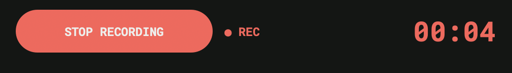
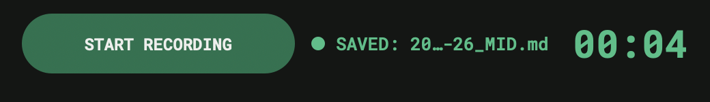
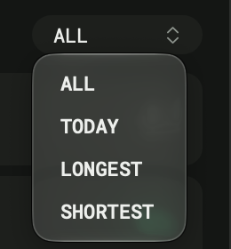
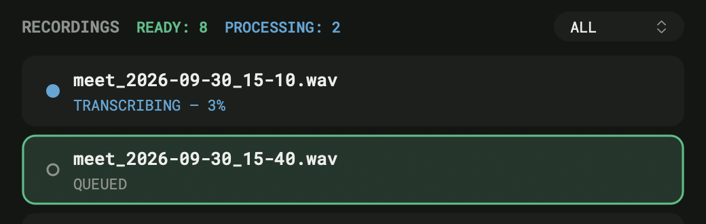
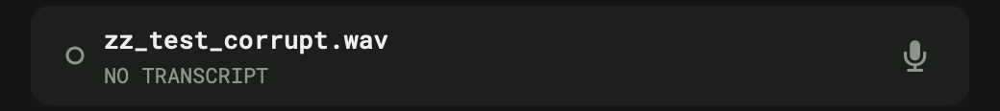
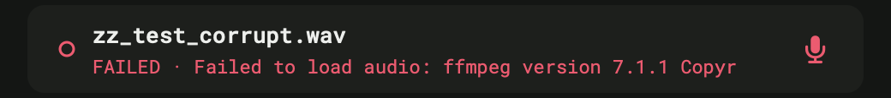
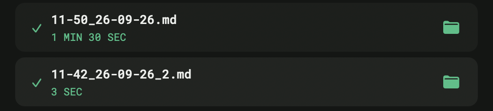
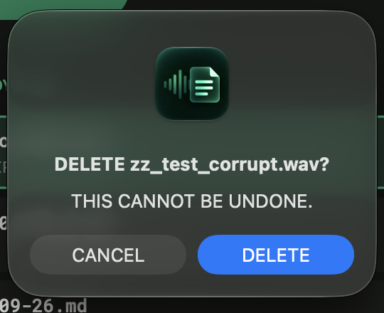

# Design system

Single source of truth: `app/theme.py`. Values below are copied from that
file. If this doc and the code disagree, the code wins and this doc is
stale.

## Principles

- **One accent color.** Anything that means "important / active / done" is
  the same green (`ACCENT`).
- **Color only where it carries information.** Status colors exist for
  processing, error, and the recording-in-progress exception. Everything
  else is neutral gray.
- **One typeface.** Roboto Mono everywhere in the window, at four weights.
  (The delete confirmation dialog and the filter menu's frame are drawn
  by macOS.)
- **Named variants, not ad-hoc conditionals.** Every component state below
  is drawn on purpose, not left to whatever AppKit does by default.
- **Layout from tokens only.** Every size and gap is a token in `theme.py`;
  `ui.py` contains constraints, not numbers (see
  [ARCHITECTURE.md](ARCHITECTURE.md#layout-autolayout-one-padding-guide)).

## Colors

| Token | Hex | Used for |
|---|---|---|
| `BG` | `#141614` | window background |
| `SURFACE` | `#1C1F1C` | cards, secondary buttons, dropdown |
| `SURFACE_SELECTED` | `#20362B` | selected card background |
| `CARD_BG_HOVER` | `#212421` | card under the mouse (between `SURFACE` and `SURFACE_SELECTED`) |
| `BORDER` | `#2B2F2B` | 1 pt outline of secondary buttons |
| `ACCENT` | `#34C085` | done status, selected-card border, `READY: N`, saved toast |
| `ACCENT_BUTTON_BG` | `#1A724E` | background of primary buttons (START RECORDING, IMPORT) |
| `TEXT_PRIMARY` | `#EDEFEC` | titles, file names, primary button text |
| `TEXT_SECONDARY` | `#8B948C` | captions, section header, secondary button text |
| `STATUS_PROCESSING` | `#4FA8D8` | "transcribing now" marker and caption, `PROCESSING: N` |
| `STATUS_ERROR` | `#FF4D6D` | failed transcription; the trash icon when it can act |
| `REMOVE_ICON_MUTED` | `#A85560` | trash icon at rest (nothing selected) |
| `RECORDING` | `#FF5F57` | the one deliberate exception: red for "recording now", the camera/Zoom/QuickTime convention |

**Contrast on green buttons.** `TEXT_PRIMARY` on `ACCENT` is only 2.01:1,
which fails WCAG even for large text. That's why primary buttons use the
deeper `ACCENT_BUTTON_BG`: 5.10:1 with the same text color (AA for normal
text). `STATUS_ERROR` on `SURFACE` is 5.18:1; `REMOVE_ICON_MUTED` is 3.27:1,
dimmer but still visible.

`STATUS_DONE` is `ACCENT` reused; "done" doesn't need its own hue.
`STATUS_ERROR` (crimson) and `RECORDING` (coral) are intentionally
different reds, so "failed" and "recording" never read as the same thing.

## Typography

Roboto Mono (Apache-2.0), bundled in `resources/fonts/` and activated for
the app process via `Info.plist` → `ATSApplicationFontsPath`. One variable
font file; the weights are its named instances (`RobotoMono-Regular`,
`-Medium`, `-SemiBold`, `-Bold`). `ui.py`'s `_font()` falls back to the
system font only when run outside the bundle (`./start.sh`), where the
Info.plist mechanism doesn't apply.

| Token | Size / weight | Used for |
|---|---|---|
| `TYPE_DISPLAY` | 28 / bold | recording timer |
| `TYPE_TITLE` | 12 / semibold | section header (`RECORDINGS`) |
| `TYPE_BODY` | 13 / medium | card title (file name); status line while the saved toast is shown (at rest the status line uses the same 13 pt, but `regular` — `refresh()` sets the size from `TYPE_BODY[0]` on every tick) |
| `TYPE_BUTTON` | 12 / semibold | button labels (semibold for legibility on green) |
| `TYPE_CAPTION` | 11 / regular | card caption, `ENGINE: PRO`, dropdown label |
| `COUNTER_TYPE` | 11 / medium | `READY: N`, `PROCESSING: N` |

## Spacing and layout

8 pt grid: `SPACE_XXS` 4 · `SPACE_XS` 8 · `SPACE_S` 12 · `SPACE_M` 16 ·
`SPACE_L` 24 · `SPACE_XL` 32.

| Token | Value | What |
|---|---|---|
| `WINDOW_WIDTH` × `WINDOW_HEIGHT` | 520 × 750 | window |
| `PANEL_PADDING_H` | 16 | **the one** horizontal padding: every row, left and right |
| `PANEL_PADDING_TOP` / `_BOTTOM` | 44 / 16 | below the transparent title bar / above the window edge |
| `HEADER_HEIGHT` | 40 | header row (= icon button size) |
| `BUTTON_HEIGHT` / `ICON_BUTTON_SIZE` | 44 / 40 | text buttons / round icon buttons |
| `RECORD_BUTTON_WIDTH` | 200 | START / STOP RECORDING |
| `PROGRESS_HEIGHT` | 6 | progress bar (space reserved even when hidden) |
| `SECTION_ROW_HEIGHT` | 22 | RECORDINGS row (= dropdown height) |
| `GAP_HEADER_RECORD` · `GAP_RECORD_PROGRESS` · `GAP_PROGRESS_SECTION` · `GAP_SECTION_LIST` · `GAP_LIST_BUTTONS` | 16 · 12 · 16 · 8 · 16 | vertical gaps between rows |
| `COUNTER_GAP` | 12 | between `READY: N` and `PROCESSING: N` |
| `CORNER_RADIUS` | 10 | cards |

## Components

### Buttons (`PillButton`)

Fully rounded (`radius = height / 2`), background drawn by us, not the
system bezel (which rounds only ~6–8 px). A button never combines an icon
and a title: with the system bezel underneath they render on top of each
other.

| Variant | Look | Where |
|---|---|---|
| **primary** | `ACCENT_BUTTON_BG` fill, `TEXT_PRIMARY` label | START RECORDING, IMPORT |
| **primary, recording** | `RECORDING` fill, label `STOP RECORDING` | record button while recording |
| **secondary** | `SURFACE` fill, 1 pt `BORDER` outline, `TEXT_SECONDARY` label | OUTPUT FOLDER, LAST FILE |
| **icon-only** | 40 pt circle, `SURFACE` fill, SF Symbol 16 pt | trash, gear (hotkeys) |

The three bottom text buttons always have equal widths (a constraint, not
integer division).

**Trash icon — two explicit states** (never the system "disabled" dimming,
which looked the same whether or not something was selected):

| State | Color | When |
|---|---|---|
| at rest | `REMOVE_ICON_MUTED` | nothing selected; a click does nothing |
| can act | `STATUS_ERROR` | a card is selected |

**Gear (hotkeys)** is visible only while Accessibility permission is
missing. When hidden it takes no space: `ENGINE: PRO` moves to the right
edge.

### Record row

| State | Button | Next to it | Timer |
|---|---|---|---|
| idle | primary, START RECORDING | gray dot + status text (`READY`, `QUEUED: …`, `ERROR: …`) | `TEXT_PRIMARY` |
| recording | red, STOP RECORDING | `● REC` in `RECORDING`, blinking (alpha 1.0 / 0.35 every 0.5 s) | `RECORDING` |
| saved toast | primary | green dot + `SAVED: <file>` in `ACCENT`, `TYPE_BODY` medium | `ACCENT` |

The status text truncates in the middle when it doesn't fit (the full text
is in the tooltip). The saved toast lasts `DONE_FLASH_SEC` (10 s) and then
returns to `READY`, but only if nothing else is going on. `ERROR` and
`MODEL FAILED` stay until something replaces them.

### Progress bar

6 pt, `SURFACE` track, `ACCENT` fill. Visible only while a file is being
transcribed; its space stays reserved so the rows below never jump.

### Counters (section row)

| Counter | Color | Shown |
|---|---|---|
| `READY: N` | `COUNTER_READY_COLOR` = `ACCENT` | always; N = all transcripts in `output/` (the list shows only the newest 15) |
| `PROCESSING: N` | `COUNTER_PROCESSING_COLOR` = `STATUS_PROCESSING` | only when N > 0; N = file being transcribed + queued files |

Both sit on the `RECORDINGS` baseline.

### Filter dropdown (`DropdownButton`)

A `PillButton` (`SURFACE`, height `DROPDOWN_HEIGHT` 22, radius 11), not
`NSPopUpButton`: that one always draws the system bezel. The label (11 pt)
and chevron (`chevron.up.chevron.down`, 10 pt) are the button's own
subviews, both centered vertically, so top and bottom padding are equal by
construction. Left padding `DROPDOWN_PADDING_LEFT` 12, right
`DROPDOWN_PADDING_RIGHT` 10, minimum width `DROPDOWN_MIN_WIDTH` 96. A
longer label (`SHORTEST`) widens the button to the left; the right edge
stays on the padding line.

The menu (ALL / TODAY / LONGEST / SHORTEST) is a native `NSMenu` forced
to Dark Aqua, with Roboto Mono medium item titles. The filter applies only
to finished transcripts; cards that need attention (transcribing, queued,
no transcript, failed) are always shown.

### Recording card (`RowCard`)

52 pt high, `CARD_GAP` 6 between cards, corner radius 10. Layout inside
the card: marker slot (`CARD_MARKER_SLOT` 14 pt wide, starting at
`CARD_PADDING_LEFT` 16) · 8 pt · title over caption (2 pt apart) · action
icon (`CARD_ACTION_SIZE` 32, `CARD_ACTION_INSET` 12 from the right). Long
file names truncate in the middle and never run under the action icon.

**Background variants** (independent of the status below; any card can be
hovered or selected):

| Variant | Background | Border |
|---|---|---|
| normal | `SURFACE` | — |
| hover | `CARD_BG_HOVER` (mouse over the card, window active) | — |
| selected | `SURFACE_SELECTED` | 1.5 pt `ACCENT` |

**Status** (`CARD_KIND_COLOR`; the marker, caption and action icon share
the color):

| kind | Marker | Caption | Color | Action icon |
|---|---|---|---|---|
| `current` — transcribing | filled dot | `TRANSCRIBING — 37%` | `STATUS_PROCESSING` | — |
| `pending` — queued | hollow ring | `QUEUED` | `TEXT_SECONDARY` | — |
| `orphan` — no transcript | hollow ring | `NO TRANSCRIPT · 1 MIN 30 SEC` | `TEXT_SECONDARY` | 🎤 transcribe |
| `error` — failed | hollow ring | `FAILED · <reason>` | `STATUS_ERROR` | 🎤 retry |
| `done` | ✓ checkmark | duration, e.g. `11 MIN 33 SEC` | `ACCENT` | 📁 show in Finder |

Durations are always whole numbers: `N SEC` under a minute, `N MIN` on
the minute, otherwise `N MIN M SEC`.

### StatusDot

Filled circle (header status dot, `current` marker) or 1.5 pt hollow ring
(`pending` / `orphan` / `error`). `done` uses the SF Symbol `checkmark` in
the same slot instead; the ring and the checkmark share one center.

### Delete confirmation

A standard `NSAlert` (warning style): `DELETE <file>?` /
`THIS CANNOT BE UNDONE.` with DELETE and CANCEL. Shown only for files on
disk. Removing a queued item needs no confirmation (nothing is lost).

## Icons

SF Symbols only (`ICONS` in `theme.py` maps role → symbol name): one line
weight, automatic Retina scaling, and a single place to update if a symbol
is renamed.

| Role | Symbol |
|---|---|
| record / transcribe | `mic.fill` |
| import | `square.and.arrow.down` |
| show in Finder | `folder.fill` |
| delete | `trash.fill` |
| hotkeys | `gearshape.fill` |
| dropdown | `chevron.up.chevron.down` |
| done | `checkmark` |
